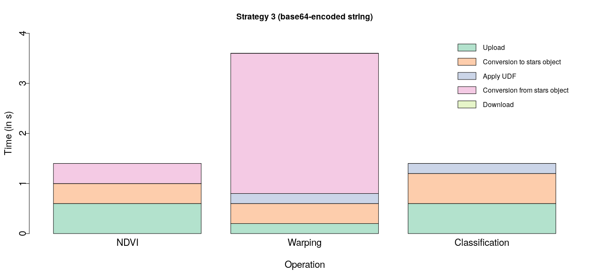
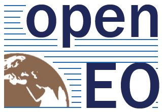

```{r setup, include=FALSE}
knitr::opts_chunk$set(echo = TRUE)
```

# Traditional EO data processing

- Requires data to be present locally
- Bottleneck for processing large data volumes
  - Bandwidth
  - Computing power
- Cloud-based processing seems the most promising solution
  - Moving code to data is easier than the other way around
- openEO aims to develop a mediating API comprehendible to compliant back-ends and clients

# User-defined Functions (UDF)

A UDF service allows users to run their own code instead of only those provided by the back-ends


# But...

- How usable would such a service be for practical purposes from the PoV of users?
  - Intended users: geographers, ecologists, modellers etc. who wish to run their code on EO data
- Is it possible to improve upon the capabilities offered by existing state-of-the-art infrastructures such as Google Earth Engine (GEE)?

# Overview of methodology

- Prototypical R package `openEO.R.UDF`  (Ghosh and Lahn, 2019) exploring 3 strategies for an UDF service
  - File-based service
  - RESTful service with EO data as JSON arrays
  - RESTful service with EO data as base64-encoded strings
- Evaluated the strategies through quantitative experiments and qualitative study
- The best strategy (using base64-encoded string) was compared with GEE with respect to usability and functionality

## UDF service implementation
Using `stars` (Pebesma, 2018)


# Results

- Implementation using base64-encoded strings offers faster results than other strategies for a variety of operations

<small>Experiments performed on 300px*300px subsets of Sentinel-2 time-series with 3 time-steps</small>

# Advantages over GEE: Usability

- R coding style need not be adapted for execution in the cloud
  - Users do not need to change the code written for their local machine drastically
  - No distinction between client- and server-side objects (Gorelick et al., 2017)
- Open source HTTP-based interface with language-agnostic open-source technologies
  - No language-specific clients to interact with the back-end (e.g. JS, Python in GEE)
  - Smooth learning curve for users

# Advantages over GEE: Functionality

- Download, install and use external libraries (R packages) at run-time from CRAN, Github etc.
  - Users not limited to pre-defined functionality
- Support for external data in a variety of formats
  - Possible for users to send supplementary data to the web-service
- External processing support
  - Users can query external processing services (e.g. WPS) over the internet as a part of their UDFs

# Limitations and Future directions

- Functionalities are at the expense of crucial limitations
  - Scalability
  - Security
  - Fault tolerance
- Possible to overcome these without compromising the advantages
- Future directions
  - Parallelization of execution by suitably chunking EO data
  - UDF archive for modular code compatible with multiple back-ends

# Conclusion

- A language-agnostic web-based UDF service could be implemented using open-source and generic technologies in a way that is practically usable by users
  - particularly in the context of the openEO project
- There is room to improve upon existing state-of-the-art infrastructures, such as GEE, and offer additional functionalities
  - requires more research to overcome limitations

# Acknowledgements



# References

- <small>**Pramit Ghosh** and Florian Lahn. openEO.R.UDF: User-defined functions (UDF) in R on Earth observation data in cloud back-ends, 2019. URL https://github.com/Open-EO/openeo-r-udf. R package version 0.1. Homepage https://open-eo.github.io/openeo-r-udf/</small>
- <small>Noel Gorelick, Matt Hancher, Mike Dixon, Simon Ilyushchenko, David Thau, and Rebecca Moore. Google Earth Engine: Planetary-scale geospatial analysis for everyone. Remote Sensing of Environment, 202:18–27, 2017. doi: [10.1016/j.rse.2017.06.031](https://doi.org/10.1016/j.rse.2017.06.031).</small>
- <small>Edzer Pebesma. stars: Scalable, Spatiotemporal Tidy Arrays, 2018b. URL https://CRAN.R-project.org/package=stars. R package version 0.2-0.</small>

- Thank you!
  - Questions?
- Contact
  - pramitghosh@uni-muenster.de
  - https://ghosh.staff.ifgi.de/
